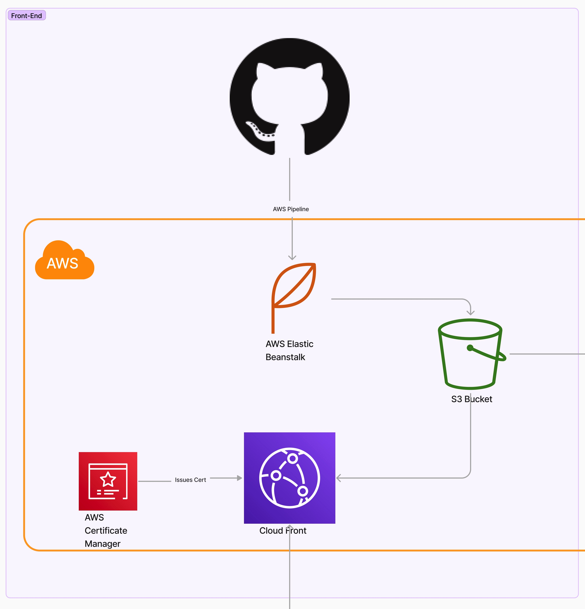

# Revazon


> Revazon is a sample e-commerce application that allows customers to buy Revature clothing and merchandise. This is a group project done as part of our cohort training at Revature.
---

### Table of Contents
You're sections headers will be used to reference location of destination.

- [Description](#description)
- [How To Use](#how-to-use)
- [References](#references)
- [License](#license)
- [Author Info](#author-info)

---

## Description

This repository serves as the frontend of an e-commerce application. Any visitors can browse featured products. Logged in users have more privileges such as adding a product to a cart, purchasing a product, and viewing profile information.

#### Technologies

- Angular
- JavaScript
- rxJs
- Bootstrap
- Html/Css
- Jasmine
- Docker
- AWS

#### Deployment Diagram


- Our frontend deployment is hosted in an AWS cloud environment. Static images and the Angular distributable files are stored in an S3 bucket. Cloud Front is used to cache our S3 files at the Edge. Certificate Manager redirects all traffic to use HTTPS. Finally, Code Pipeline was used as a CI/CD pipeline configured to build and deploy on each push to the dev branch.
---

## How To Use


#### Installation

```html
    git clone https://github.com/Revature-Sophia-ECommerce-1376/e-commerce-frontend-angular.git
```

#### Running the Application
- Run `ng serve` for a dev server. Navigate to `http://localhost:4200/`. The app will automatically reload if you change any of the source files.

- Run `ng build` to build the project.

- Run `ng test` to execute the unit tests via [Karma](https://karma-runner.github.io).


#### API Reference
https://app.swaggerhub.com/apis/ANDYHUGHES39_1/Revazon/1.0.0
```html
    
```


---

## References


---

## License

MIT License

Copyright (c) [2022] [Revature]

Permission is hereby granted, free of charge, to any person obtaining a copy
of this software and associated documentation files (the "Software"), to deal
in the Software without restriction, including without limitation the rights
to use, copy, modify, merge, publish, distribute, sublicense, and/or sell
copies of the Software, and to permit persons to whom the Software is
furnished to do so.


---

## Contributors


[Back To The Top](#read-me-template)